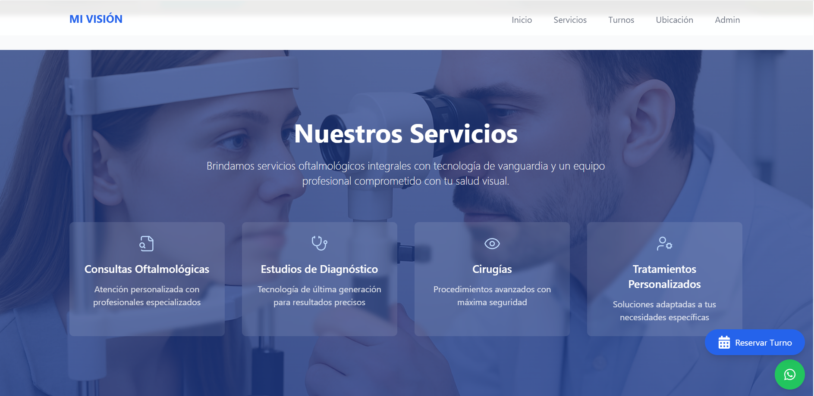

# MI VISIÓN - Sistema de Gestión de Turnos Oftalmológicos


## 📋 Descripción
MI VISIÓN es una aplicación web moderna para la gestión de turnos oftalmológicos que facilita la reserva y administración de citas médicas. Integra un sistema de chat automático para mejorar la experiencia del usuario.

## 🚀 Características Principales
- ⚡ Reserva de turnos en tiempo real
- 👥 Panel de administración para profesionales
- 📱 Integración con WhatsApp para recordatorios
- 📅 Gestión de disponibilidad por profesional
- 🏥 Múltiples sedes médicas
- 📊 Dashboard con estadísticas

## 🛠️ Tecnologías Utilizadas
- React 18
- TypeScript
- Tailwind CSS
- Node.js
- MySQL
- WhatsApp API
- Dialogflow (próximamente)


## 📸 Capturas de Pantalla

<div align="center">
  
  <p><em>Panel de Administración de MI VISIÓN</em></p>

  
  <p><em>Sistema de Reserva de Turnos</em></p>

  
  <p><em>Integración con WhatsApp</em></p>
</div>

## 🔧 Instalación

```bash
# Clonar el repositorio
git clone https://github.com/tu-usuario/mivision-turnos-app.git

# Instalar dependencias
cd mivision-turnos-app
npm install

# Configurar variables de entorno
cp .env.example .env
# Editar .env con tus configuraciones

# Iniciar la aplicación
npm start
```

## 📦 Estructura del Proyecto
```
mivision-turnos-app/
├── src/
│   ├── components/
│   │   ├── admin/
│   │   ├── booking/
│   │   └── common/
│   ├── services/
│   ├── types/
│   └── utils/
├── public/
└── docs/
```

## 🤝 Contribución
Las contribuciones son bienvenidas. Por favor, lee el archivo [CONTRIBUTING.md](CONTRIBUTING.md) para más detalles.

## 📄 Licencia
Este proyecto está bajo la Licencia MIT - ver el archivo [LICENSE.md](LICENSE.md) para más detalles.

## 👥 Equipo
- Frontend Developer: Daniel Costella
- Backend Developer: Daniel Costella
- UI/UX Designer: Daniel Costella

## 🌟 Agradecimientos
- [WhatsApp Business API]
- [React Community]
- [Tailwind CSS]
