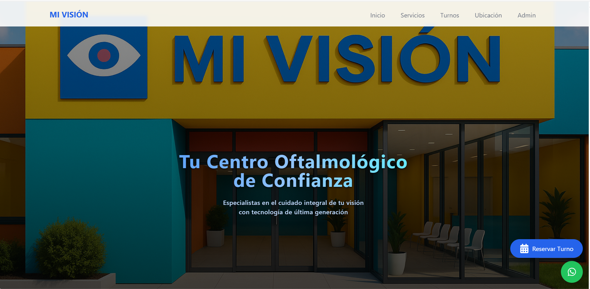
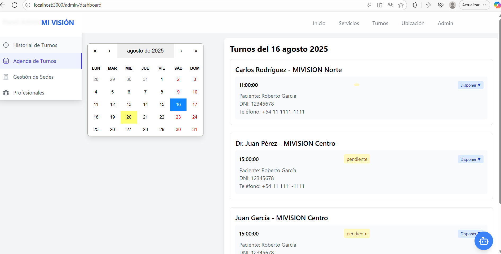
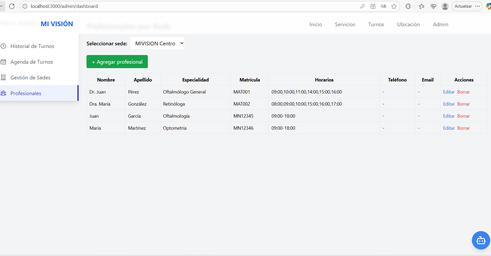

# MI VISIÓN - Sistema de Gestión de Turnos

<div align="center">
  
  <p><em>Panel Principal de MI VISIÓN</em></p>

  
  <p><em>Sistema de Reserva de Turnos</em></p>

  
  <p><em>Panel Administracion de MI VISIÓN</em></p>
</div>


  <p><em>Panel Edicion de MI VISIÓN</em></p>
</div>

Sistema completo para gestión de turnos en centro de oftalmología con 2 sedes y múltiples profesionales.

## 🚀 Tecnologías Utilizadas

### Backend
- **Node.js** - Runtime de JavaScript
- **TypeScript** - JavaScript con tipos estáticos
- **Express** - Framework web
- **MySQL** - Base de datos
- **JWT** - Autenticación
- **CORS** - Cross-origin requests
- **Helmet** - Seguridad

### Frontend (próximamente)
- **React** - Framework de UI
- **Tailwind CSS** - Framework de estilos
- **TypeScript** - Tipado estático

## 📋 Requisitos Previos

1. **Node.js** (versión 16 o superior)
2. **MySQL** (versión 8.0 o superior)
3. **npm** o **yarn**

## 🛠️ Instalación

### 1. Clonar el repositorio
```bash
git clone <url-del-repositorio>
cd MIVISION
```

### 2. Instalar dependencias
```bash
npm install
```

### 3. Configurar la base de datos

#### Opción A: Usando MySQL Workbench
1. Abrir MySQL Workbench
2. Conectar a tu servidor MySQL
3. Ejecutar el script `database/schema.sql`

#### Opción B: Usando línea de comandos
```bash
mysql -u root -p < database/schema.sql
```

### 4. Configurar variables de entorno
```bash
# Copiar el archivo de ejemplo
cp env.example .env

# Editar .env con tus datos
nano .env
```

### 5. Configurar .env
Edita el archivo `.env` con tus datos:

```env
# Configuración del servidor
PORT=3000
NODE_ENV=development

# Configuración de CORS
CORS_ORIGIN=http://localhost:3001

# Configuración de la base de datos MySQL
DB_HOST=localhost
DB_PORT=3306
DB_USER=root
DB_PASSWORD=tu_password_aqui
DB_NAME=mivision_db

# Configuración JWT
JWT_SECRET=tu-clave-secreta-aqui
JWT_EXPIRES_IN=24h

# Configuración de WhatsApp
WHATSAPP_PHONE=+5491112345678
WHATSAPP_API_KEY=tu_api_key_aqui
WHATSAPP_WEBHOOK_URL=https://tu-dominio.com/api/whatsapp/webhook

# Configuración de IA (opcional)
OPENAI_API_KEY=tu_openai_api_key_aqui
AI_MODEL=gpt-3.5-turbo
```

## 🚀 Ejecutar el proyecto

### Desarrollo
```bash
npm run dev
```

### Producción
```bash
npm run build
npm start
```

## 📡 Endpoints de la API

### Sedes
- `GET /api/sedes` - Obtener todas las sedes
- `GET /api/sedes/:id` - Obtener una sede específica
- `POST /api/sedes` - Crear nueva sede
- `PUT /api/sedes/:id` - Actualizar sede
- `DELETE /api/sedes/:id` - Eliminar sede

### Profesionales
- `GET /api/profesionales` - Obtener todos los profesionales
- `GET /api/profesionales/:id` - Obtener profesional específico
- `GET /api/profesionales/sede/:sedeId` - Profesionales por sede
- `POST /api/profesionales` - Crear nuevo profesional
- `PUT /api/profesionales/:id` - Actualizar profesional
- `DELETE /api/profesionales/:id` - Eliminar profesional

### Usuarios
- `GET /api/usuarios` - Obtener todos los usuarios
- `GET /api/usuarios/:id` - Obtener usuario específico
- `GET /api/usuarios/dni/:dni` - Buscar usuario por DNI
- `POST /api/usuarios` - Crear nuevo usuario
- `PUT /api/usuarios/:id` - Actualizar usuario
- `DELETE /api/usuarios/:id` - Eliminar usuario

### Turnos
- `GET /api/turnos` - Obtener todos los turnos
- `GET /api/turnos/:id` - Obtener turno específico
- `POST /api/turnos` - Crear nuevo turno
- `PUT /api/turnos/:id` - Actualizar turno
- `DELETE /api/turnos/:id` - Cancelar turno
- `GET /api/turnos/disponibilidad/:profesionalId/:fecha` - Verificar disponibilidad

## 🗄️ Estructura de la Base de Datos

### Tablas principales:
1. **sedes** - Información de las sedes
2. **profesionales** - Médicos y especialistas
3. **usuarios** - Pacientes
4. **turnos** - Citas programadas

### Relaciones:
- Un profesional pertenece a una sede
- Un turno tiene un usuario, un profesional y una sede
- Validaciones para evitar conflictos de horarios

## 🔧 Scripts Disponibles

```bash
npm run dev      # Ejecutar en modo desarrollo
npm run build    # Compilar TypeScript
npm start        # Ejecutar en producción
npm test         # Ejecutar tests (próximamente)
```

## 📱 Próximos Pasos

1. **Frontend React** - Interfaz de usuario
2. **Chatbot WhatsApp** - Integración con IA
3. **Sistema de notificaciones** - SMS/Email
4. **Panel de administración** - Gestión avanzada
5. **Reportes y estadísticas** - Análisis de datos

## 🐛 Solución de Problemas

### Error de conexión a MySQL
- Verificar que MySQL esté corriendo
- Revisar credenciales en `.env`
- Asegurar que la base de datos existe

### Error de TypeScript
- Ejecutar `npm run build` para ver errores
- Verificar tipos en `src/types/index.ts`

### Error de CORS
- Verificar `CORS_ORIGIN` en `.env`
- Asegurar que el frontend esté en la URL correcta

## 📞 Soporte

Para dudas o problemas, contactar al equipo de desarrollo.

---

**MIVISION** - Centro de Oftalmología 🏥

## ✨ Características Principales

### 🤖 Asistente Virtual
El sistema cuenta con un asistente virtual inteligente que facilita la reserva de turnos:

<div align="center">
  
  <p><em>Asistente Virtual Inteligente</em></p>
</div>

- Interfaz intuitiva y fácil de usar
- Disponibilidad 24/7
- Respuestas rápidas y precisas
- Integración con el sistema de gestión de turnos

---

**MI VISIÓN** - Sistema de Gestión de Turnos 👁️